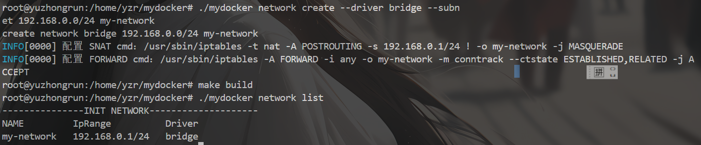
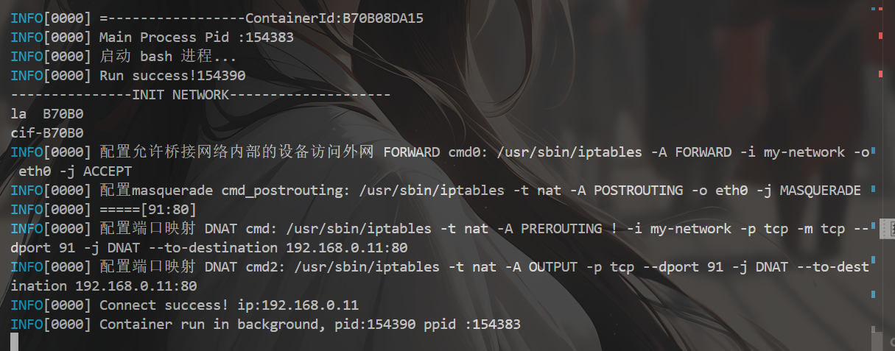
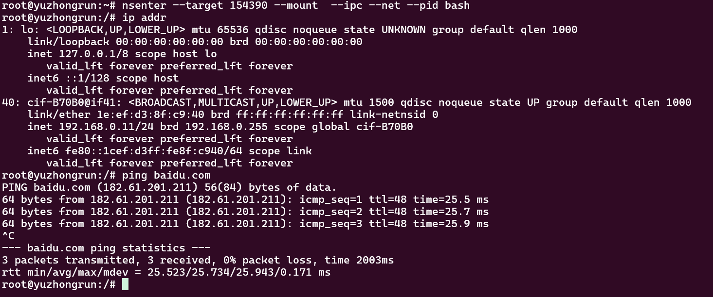
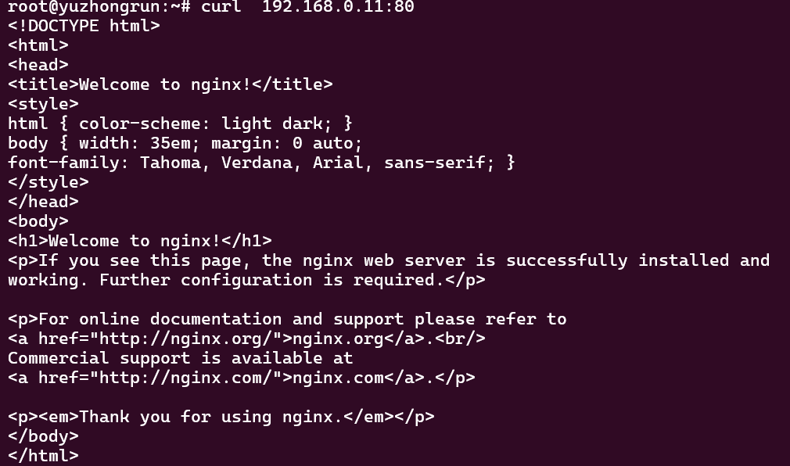
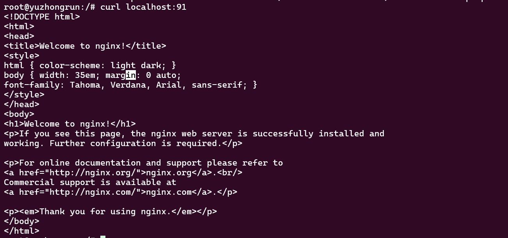

## my-docker Command Line Usage


* mydocker  pull nginx   # 下载 nginx 镜像
* mydocker  run -it -image mysql /bin/bash   # 运行容器并进入交互模式 容器内主进程/bin/bash
* mydocker  ps  
* mydocker  images
* mydocker  rm <container-id>

使用网络前要打开本地ip4转发：
```
echo 1 > /proc/sys/net/ipv4/ip_forward
```
* mydocker network create --driver bridge --subnet 192.168.0.0/24 my-network
* mydocker network list

由于容器内部需要一个主程序运行，目前采取手动命令启动
```shell
./docker-entrypoint.sh 'nginx -g "daemon off;"' # 启动 nginx 容器
```
* ./mydocker run -p 91:80 -image nginx ./docker-entrypoint.sh 'nginx -g "daemon off;"'  -net my-network

我们可以使用nsenter工具进入容器内部，查看ip是否配置正确：能不能访问外部网络

直接访问容器ip可以成功访问到nginx服务

端口映射页成功了！

## my-docker 存储目录结构
├── image/
│   └── overlay2/
│       ├── distribution/
│       │   ├── diffid-by-digest/sha256/        # 通过 digest 查找 diff_id  /image/overlay2/distribution/diffid-by-digest/sha256/
│       │   └── v2metadata-by-diffid/sha256/   # 通过 diff_id 查找元数据
│       ├── imagedb/
│       │   ├── content/sha256/                # 存储镜像的 Config 文件/image/overlay2/imagedb/metadata/sha256/
│       │   └── metadata/sha256/               # 存储镜像的元数据 
│       └── layerdb/ 
│           ├── mounts/                        # 挂载层的元数据
│           └── sha256/                        # 存储镜像层的元数据
│               ├── <chain-id>/                # 每个层对应一个目录
│               │   ├── cache-id              # 层的 cache-id
│               │   ├── diff                  # 层的 diff_id
│               │   ├── parent                # 层的父层的链标识符
│               │   ├── size                  # 层的大小
│               │   └── tar-split.json.gz     # 层的文件系统变更记录
├── overlay2/                                 # 存储解压后的文件系统
│   └── <cache-id>/                          # 每个层对应一个目录            
│       ├── diff/                             # 该层的文件系统变更内容            ok
│       ├── link                              # 符号链接，指向短标识符
│       ├── lower                             # 指向父层的路径
│       └── work/                             # 工作目录
│   └──l/                                      # 短标识符n     短哈希指向缓存目录
└── containers/                              # 存储容器的元数据和日志
    └── <container-id>/                      # 每个容器对应一个目录
          ├── config.v2.json                   # 容器的配置文件
          └── <container-id>-json.log          # 容器的日志文件


